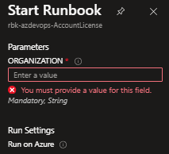

# infra-az-azdevops-AccountLicense

- pode ser utilizado no automation account ou no azure devops

- O Parametro $organization deverá ser preenchido na hora do schedule ou quando for rodado manualmente.
- O validateSet deverá ser preenchido com as organization

- Deverá ser gerado um PAT para ter permissão no processo de mudança de SKU do usuário.

